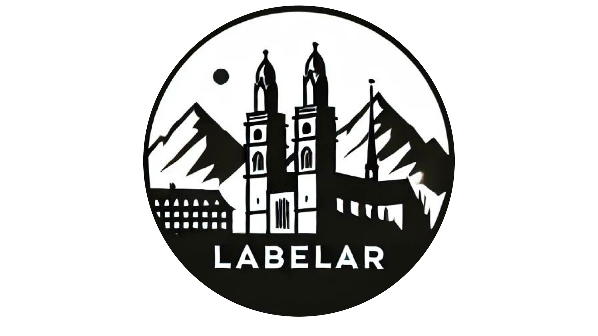

<h1 align="center">LabelAR</h1>

    

     Video&nbsp;&nbsp;&nbsp;
     Report&nbsp;&nbsp;&nbsp;
     Poster&nbsp;&nbsp;&nbsp;
     Proposal

  

LabelAR is a Unity application developed for the [Mixed Reality](https://cvg.ethz.ch/lectures/Mixed-Reality/) course at ETH Zürich. You can find links to the report, poster, and proposal above, as well as a demo video.

The application is split in two parts: within the `backend` folder you can find the code to run the PostGIS database and the FastAPI webserver (we also host this at `labelar.ilbrigante.me`), while the Unity project is in the `unity` folder. Refer to the respdective READMEs for a breakdown of the installation.
